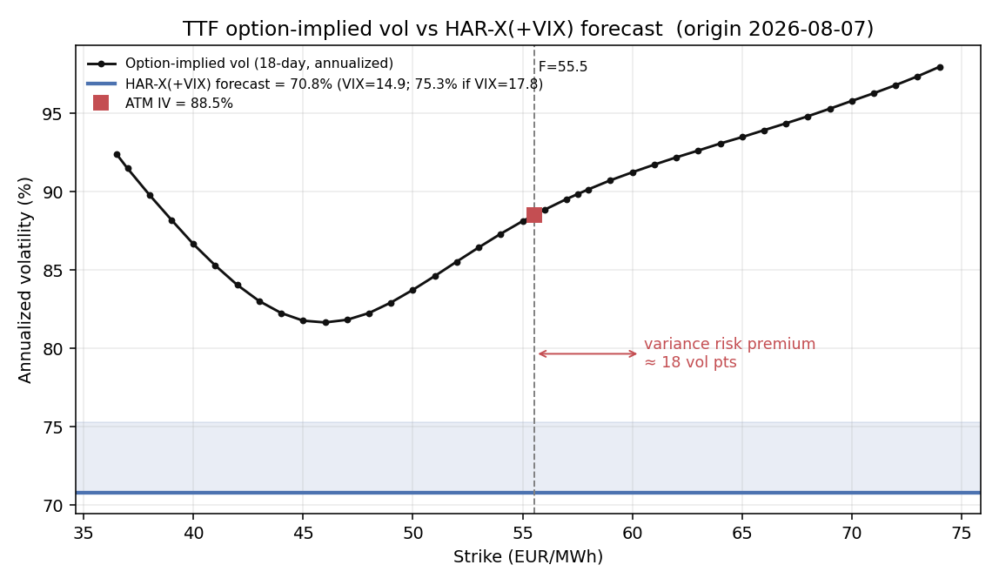

# Applying the HAR-X(+VIX) Volatility Forecast to TTF Options: A Worked Illustration

Glen Kurokawa

*Prepared August 2026.*

## 1. Purpose and scope

The companion studies establish two results about month- and week-ahead Dutch TTF natural gas prices: the price level is close to a random walk and is not forecastable even under perfect foresight of fundamentals, whereas the second moment is forecastable, with a heterogeneous-autoregressive model augmented by the VIX (HAR-X) improving on a persistence benchmark out of sample. Those results concern the *physical* distribution of returns — how volatile TTF is likely to be. This note takes the next step and asks how such a forecast might be *used* once it exists.

The natural application is a comparison with the option market. Implied volatility, backed out of TTF call and put prices, is the market's *risk-neutral* expectation of volatility over the option's life, and read across strikes it summarises the market's view of the whole return distribution. 

The exercise is illustrative rather than empirical. It uses a single day's option chain (a free Barchart download for 8 August 2026) and a forward-week VIX supplied by proxy. The figures below should therefore be read as a demonstration of method.

## 2. Recovering the forward and discount factor from the chain

The input is a TTF option chain dated 8 August 2026, comprising forty strikes from 36.5 to 74 EUR/MWh, each with a call and a put settlement price. Because TTF options are options on the TTF futures, implied volatilities are obtained from the Black-76 model. Rather than source these externally, both are recovered from the chain itself through put-call parity, since a call and a put are quoted at every strike (Appendix A). 

## 3. Implied volatilities at the traded expiry

The options expire on 26 August 2026, so that, valued as of 8 August, the time to maturity is $T = 18/365 = 0.0493$ years. Inverting Black-76 strike by strike produces the smile in Table 1. 

The smile attains its minimum of about 81.7% near the 46 strike and rises on both wings, with a pronounced upside (call) skew: implied volatility ten percent above the forward exceeds that ten percent below by roughly eight volatility points. This asymmetry is characteristic of TTF, reflecting persistent demand for protection against upward price spikes. At-the-money implied volatility, interpolated at the forward, is 88.5% annualised.

**Table 1.** TTF Black-76 implied volatilities, expiry 26 August 2026 ($T = 18$ days), forward $F = 55.54$. Call and put implied volatilities coincide at every strike by put-call parity, so a single value is reported.

| Strike | ln(K/F) | Implied Vol (%) |
|---:|---:|---:|
| 36.50 | −0.420 | 92.41 |
| 37.00 | −0.406 | 91.49 |
| 38.00 | −0.380 | 89.80 |
| 39.00 | −0.354 | 88.21 |
| 40.00 | −0.328 | 86.67 |
| 41.00 | −0.304 | 85.30 |
| 42.00 | −0.280 | 84.06 |
| 43.00 | −0.256 | 83.03 |
| 44.00 | −0.233 | 82.27 |
| 45.00 | −0.211 | 81.78 |
| 46.00 | −0.189 | 81.66 |
| 47.00 | −0.167 | 81.83 |
| 48.00 | −0.146 | 82.26 |
| 49.00 | −0.125 | 82.93 |
| 50.00 | −0.105 | 83.74 |
| 51.00 | −0.085 | 84.63 |
| 52.00 | −0.066 | 85.55 |
| 53.00 | −0.047 | 86.45 |
| 54.00 | −0.028 | 87.32 |
| 55.00 | −0.010 | 88.13 |
| 56.00 | +0.008 | 88.86 |
| 57.00 | +0.026 | 89.54 |
| 57.50 | +0.035 | 89.85 |
| 58.00 | +0.043 | 90.16 |
| 59.00 | +0.060 | 90.74 |
| 60.00 | +0.077 | 91.25 |
| 61.00 | +0.094 | 91.74 |
| 62.00 | +0.110 | 92.20 |
| 63.00 | +0.126 | 92.63 |
| 64.00 | +0.142 | 93.08 |
| 65.00 | +0.157 | 93.49 |
| 66.00 | +0.172 | 93.93 |
| 67.00 | +0.188 | 94.37 |
| 68.00 | +0.202 | 94.82 |
| 69.00 | +0.217 | 95.31 |
| 70.00 | +0.231 | 95.80 |
| 71.00 | +0.246 | 96.29 |
| 72.00 | +0.259 | 96.81 |
| 73.00 | +0.273 | 97.37 |
| 74.00 | +0.287 | 97.98 |

*Summary:* at-the-money 88.53%; minimum 81.66% near $K = 46$; skew $\text{IV}(+10\%) - \text{IV}(-10\%) = +8.05$ points; wing range 81.7%–98.0%.

## 4. Horizon of the comparison

The option has eighteen days to expiry, whereas the HAR-X(+VIX) forecast covers the coming seven calendar days (five trading days). No adjustment is made to reconcile the two tenors.

## 5. Application: the forecast as a benchmark for implied volatility

The HAR-X(+VIX) model, re-estimated on the daily data set (training through 28 February 2025), is evaluated at the last trading close, 7 August 2026 — the origin that matches the option settlement date. Supplying the current VIX (14.9) as the forward-week input — the deployable, no-look-ahead choice discussed in Section 6 — the model forecasts

$$
\hat{\sigma}_{\text{ann}} = \sqrt{\widehat{RV}^{(w)}\cdot 252/5} \approx 70.8\%
$$

for the week ahead, with the log-to-level correction applied. The forecast is not sensitive to the VIX input: the VIX enters with a small coefficient. The realised-variance cascade is what carries the forecast, and its early-August increase is the reason the current reading (70.8%) exceeds the calmer late-July estimate (about 62–67%) despite the lower VIX.

The forecast uses the four-term HAR-X(+VIX) specification — the HAR cascade of daily, weekly, and monthly realised variance together with the forward-week VIX.

Placed against the market, the forecast sits well below the option smile. At the money the market implies 88.5% annualised while the model forecasts 70.8%, a difference of approximately eighteen volatility points (Figure 1). This wedge is primarily the variance risk premium — the market charging materially more for near-dated TTF volatility than the model expects to be realised, consistent with sellers of gas volatility earning a premium and with the positive average variance risk premium documented for natural gas.

**Figure 1.** TTF option-implied volatility (18-day, annualised) against the HAR-X(+VIX) forecast at the 7 August 2026 origin. The market prices 88.5% at the money against a 70.8% model forecast (VIX $= 14.9$; 75.3% at the late-July VIX), a variance risk premium of approximately eighteen volatility points.

## 6. Treatment of the VIX under perfect foresight

A natural question in applying the model is whether the seven-day-ahead VIX must itself be forecast, given that the specification enters the VIX under perfect foresight. In the out-of-sample tests of the companion study the answer is no: perfect foresight means the model is supplied the realised forward-week VIX, which in a historical backtest already exists in the sample. No forecast of the VIX is involved, and the resulting predictability is properly understood as an upper bound.

For a live forecast the situation differs, because the forward week has not yet occurred and its VIX cannot be observed. For simplicity, we use the current day's VIX.

## Appendix A. Black-76, recovery of the forward and discount factor, and the horizon-neutrality of annualised volatility

**Black-76.** A European option on a futures price $F$ with strike $K$, maturity $T$, volatility $\sigma$, and discount factor $DF = e^{-rT}$ is valued by

$$
C = DF\,[\,F\,N(d_1) - K\,N(d_2)\,], \qquad P = DF\,[\,K\,N(-d_2) - F\,N(-d_1)\,],
$$
$$
d_1 = \frac{\ln(F/K) + \tfrac{1}{2}\sigma^2 T}{\sigma\sqrt{T}}, \qquad d_2 = d_1 - \sigma\sqrt{T}.
$$

Given a market premium, the implied volatility is the value of $\sigma$ that equates the formula to the observed price. Since Black-76 is monotone in $\sigma$, the root is unique and is located numerically (here by Brent's method).

**Recovery of the forward and discount factor.** The inversion requires $F$ and $DF$, neither of which is quoted in the option file, and one might expect to obtain the underlying futures price and an interest rate from an external source. This is unnecessary, because a call and a put are quoted at each strike and are linked by put-call parity,

$$
C(K) - P(K) = DF\,(F - K).
$$

The relation is exact and model-free: it follows from no-arbitrage alone, independently of Black-76. Read as a straight line in the strike,

$$
\underbrace{C(K) - P(K)}_{y} = \underbrace{DF\cdot F}_{\text{intercept}} \;-\; \underbrace{DF}_{\text{slope magnitude}}\,K,
$$

an ordinary least-squares regression of $C - P$ on $K$ returns the discount factor as the negative of the slope and $DF\cdot F$ as the intercept, whence

$$
DF = -\,\text{slope}, \qquad F = \frac{\text{intercept}}{DF}, \qquad r = -\frac{\ln DF}{T}.
$$

Every input is thus obtained from the option premiums: the underlying futures price is implied by the call-put spreads rather than read from a quote, and the interest rate follows from the same regression through the discount factor. On the present chain the fit is exact to six decimal places ($R^2 = 1.000000$ over forty strike pairs), giving $F = 55.54$ and $DF = 1.00000$, the latter reflecting negligible discounting over eighteen days at near-zero euro rates. The procedure also affords an internal consistency check: with $F$ and $DF$ correct, the call and the put at each strike must invert to the same implied volatility, and they do (Table 1); a discrepancy would indicate an error in the recovered forward or discount factor.

**Why annualised volatility is horizon-neutral.** Expanding Black-76 at the money ($K = F$) for small $\sigma\sqrt{T}$ gives the premium

$$
C_{\text{ATM}} \approx DF\cdot F\cdot \frac{\sigma\sqrt{T}}{\sqrt{2\pi}} \approx 0.3989\,DF\,F\,\sigma\sqrt{T},
$$

so the premium scales with $\sigma\sqrt{T}$ and the annualised volatility $\sigma$ is recovered by dividing the $\sqrt{T}$ back out. Because that normalisation is built into the quantity, an annualised implied volatility at one tenor and an annualised forecast at another are stated in common units and may be compared directly; no re-dating of either instrument to a common maturity is required, and re-dating a premium to force the maturities to coincide would merely reintroduce the $\sqrt{T}$ that annualisation removes. The one effect annualisation does not capture is a genuine difference in volatility between the two horizons — the term structure — which is an empirical feature of the market rather than an artefact of units.
