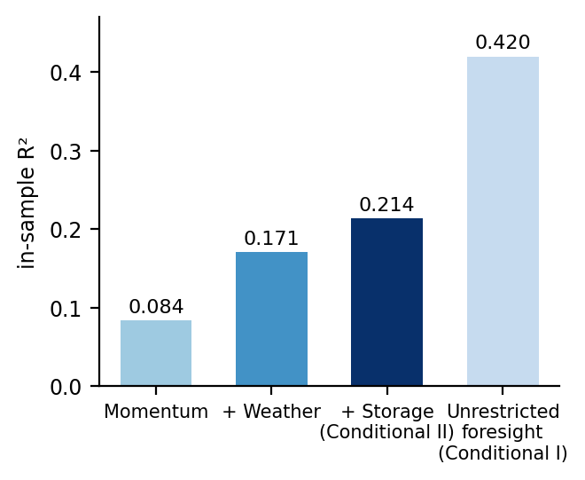
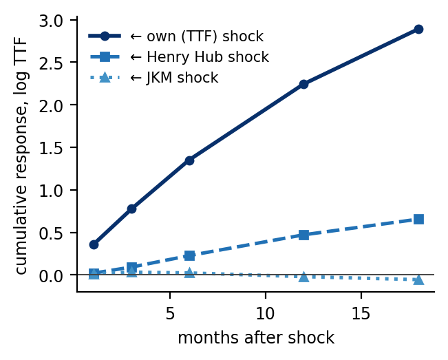

# What Is Knowable About Average Month-Ahead European Gas Prices? Forecasting, Cross-Hub Transmission, and Volatility, 2015–2026

*Prepared 1 August 2026.*

## Abstract

This paper asks what is and is not knowable, one month ahead, about the price of European natural gas (the Dutch TTF benchmark), using a monthly dataset spanning January 2015 to May 2026 and a no-look-ahead, out-of-sample methodology. The study addresses the question from four directions. First, it tests whether and how much TTF returns can be forecast from European fundamental variables: market balance, storage, power generation, pipeline supply, and weather. Second, global gas variables are added — JKM, US Henry Hub, global LNG supply and trade, non-European weather — and the paper asks whether the addition improves on the European model to forecast TTF prices. Third, it estimates cointegration among the three major price hubs, an error-correction model, and a vector error-correction model (VECM) to characterise price transmission and leadership. Fourth, it models TTF volatility. Throughout, the paper benchmarks results against a random walk, uses perfect-foresight upper bounds to distinguish between the "fundamentals do not matter" from the "fundamentals matter but are unforecastable" belief, and cross-checks results with regularised and dimension-reduction machine learning.

The findings are consistent. The average month-ahead TTF price is close to a random walk. Only storage change and price momentum carry durable signals, and global fundamentals contribute little. The three hub prices are cointegrated but error-correct too slowly to exploit on a monthly basis, and even perfect month-ahead foresight of fundamental variables does not beat a random walk out of sample. Regularisation and machine learning supports this. Structure does however exist in two places. In the cross-hub system, TTF is the price leader — weakly exogenous, Granger-causing JKM prices, and the source of most of its own forecast-error variance. This is a feature that predates the 2021–2022 energy crisis. The structural contribution of the crisis was to pull the previously decoupled US hub into the global market. Second, TTF volatility clusters strongly, near-integrated, and modestly forecastable out of sample. The overarching result therefore is that the direction of next month's average European gas price is difficult to forecast, but its risk and its relationship to other hub prices have structure.

**Keywords**: natural gas, TTF, JKM, Henry Hub, cointegration, VECM, price transmission, GARCH, market integration.

## 1. Introduction

European natural gas prices have become much more important, particularly due to the Ukraine war. The Title Transfer Facility (TTF) price rose roughly twentyfold and collapsed again as Europe lost the bulk of its Russian pipeline supply and re-sourced itself on the global LNG market. That episode makes the European gas prices difficult to study: a single crisis dominates any recent sample.

This paper asks: how much of the month-ahead change in TTF can be explained or forecast? It answers the question with as much out-of-sample (OOS) as a short monthly from January 2015 to mid-2026 sample allows. We fix the horizon at one month (H = 1) throughout, to maximise degrees-of-freedom and because it is the horizon at which fundamental market data is available for this study. The study imposes a no-look-ahead, deseasonalised anomaly. Every forecast is evaluated by a walk-forward expanding-window against a random walk with a Diebold–Mariano test. Wherever a model assumes perfect-foresight contemporaneous information (aside from the price) to forecast TTF prices, this study refers to it as a conditional (perfect-foresight) forecast.

Section 2 provides a literature review. Section 3 provides a description of data and methods. Sections 4–7 provide details of the four parts of the study. Section 4 builds a European gas model. Section 5 widens the variable set to include global natural gas variables and estimates the structure that governs how the world's gas hub prices move together. Section 6 examines TTF price volatility. Section 7 tests machine-learning methods as a robustness check. Sections 8 and 9 discuss results and conclude.

## 2. Literature review

**2.1 Market integration and price cointegration.** Literature traces the slow integration of separate regional natural gas markets. Early cointegration studies found the world's gas markets segmented into an oil-indexed Europe/Asia bloc and a gas-on-gas North America bloc, which were only weakly linked across the Atlantic (Siliverstovs et al., 2005 using PCA and cointegration tests on monthly import prices). LNG progressively integrated them: Ialenti (2021) tied convergence explicitly to the surge in US LNG exports by comparing Henry Hub with TTF and NBP using cointegration on monthly price series. Chiappini et al. (2019) obtained pairwise cointegration between the US and the European and Asian hubs with structural breaks on daily price data. This study's cointegration results (Section 5.3) are consistent with this: the hub prices are cointegrated but adjust slowly and, in a single-equation error-correction model (ECM), insignificantly.

**2.2 Price transmission and leadership.** Newer literature queries price leadership, i.e. which price moves first. Within Europe and before the Ukraine war, Papież et al. (2022) find TTF and Germany's NCG as the leading intra-European hubs. Globally, Charteris et al. (2025) find that European gas benchmarks are net transmitters while Asian and US benchmarks are net receivers. The cited studies essentially use forecast-error variances on daily price data. This study's VECM (Section 5.4) reaches a similar conclusion through weak-exogeneity and Granger tests and adds that TTF leadership over Asia predates the crisis.

**2.3 Price forecasting.** Storage and weather often feature in studies covering the short-term dynamics of natural gas prices. Structural-VAR studies for NCG (Nick & Thoenes, 2014 using weekly data) and Henry Hub prices (Wiggins & Etienne, 2017 using weekly data) support this. Martínez & Torró (2023) find a weak but significant influence of storage on NBP essentially using OLS on monthy data. That weak-storage finding is a close match to this study's muted result. On predictability, Baumeister et al. (2024) show Henry Hub prices are forecastable up to two years in the future using real-time inputs, including futures prices, in a pool of forecasting models. The paper uses a pool of models, including autoregressive models, on monthly data. Our finding for the H = 1 mean is consistent with the literature that TTF prices are difficult to forecast.

**2.4 Volatility and the crisis.** Research focussing on TTF volatility is limited but has grown since the European energy crisis. Berrisch & Ziel (2022) obtains month-ahead European gas forecasting gains that are essentially distributional (volatility and tails), not price forecasting improvements, using state-space and volatility modelling. Botta, Cerqueti and Savona (2025) use daily TTF data but focus on conditional volatility and its transmission, estimating a suite of ARMA-GARCH specification and produce out-of-sample TTF volatility forecasts. Our results also show that there is structure to TTF volatility.

**2.5 Machine learning techniques.** A growing machine-learning literature forecasts European gas prices at high frequency. Bajatović, Erdemlioglu & Gradojević (2024) forecast day-ahead TTF and Henry Hub prices with non-linear, non-parametric deep-learning models on daily data, reporting gains over parametric benchmarks. Böhm et al. (2023) apply feed-forward artificial neural networks to forecast day-ahead German (NCG) gas and EU carbon prices on roughly thirteen years of daily observations (2007–2020, ~4,500 data points). Both use daily multi-year samples of several thousand observations in contrast to the monthly, small number of observations in this study.

The literature broadly anticipates this study's results of cointegrated-but-slow markets, TTF price leadership, storage dominating variable significance and near-unforecastable prices, regime-concentrated volatility. This study however (1) brings studies all four questions using one consistent and recent dataset with a uniform OOS discipline, and (2) tests how much TTF prices can forecast using perfect foresight of all variables except the price.

## 3. Data and methodology

**3.1 Data.** This study's dataset is monthly January 2015 to May 2026 (~137 observations). The three front-month hub prices are TTF (Europe), JKM (Asia), and Henry Hub (US), in USD/mmbtu, obtained from Yahoo Finance. European gas market fundamentals cover EU+UK gas balance and storage; production, net pipeline imports, LNG imports, net supply, total gas demand; power demand and power generation (gas, coal, nuclear, hydro, residual load); Norwegian pipeline supply (production, supply reduction, planned and unplanned outages); and European weather (heating and cooling degree days, wind speed, solar irradiation, Nordic precipitation). European data was collected from AGSI, Eurostat, national statistical agencies, ENTSOG, JODI, ENTSOE, Ember, Gassco, ECMWF, and miscellaneous sources. The global gas model adds non-European weather and supply risk (US and Northeast Asia degree days, Atlantic hurricane energy, Gulf storm days); global LNG supply and trade (world nameplate capacity and capacity offline); Asia and India LNG imports; Qatar, Australia, US, Southeast Asia, and Nigeria LNG exports; and financial variables (VIX and USD–EUR FX). Global data was compiled from ECMWF, JODI, IGU, GIIGNL, IEA, and miscellaneous sources. 

All price series are in nominal terms. Because the horizon is one month and the target is a log return, deflation would subtract only the monthly inflation rate, which is negligible. Adopting real prices would moreover require justifying a particular deflator (e.g. US CPI, a PPI, or a global aggregate) and using lagged and revision-prone index vintages, so prices are kept in nominal terms.

**3.2 No-look-ahead feature construction.** Every predictor was transformed into a deseasonalised anomaly series: the raw series minus an expanding, prior-years-only calendar-month average. Trending flow variables that fail stationarity tests in levels are entered as month-over-month changes, which are stationary. Predictors are then either lagged one month (in a lagged, real-time forecast) or entered contemporaneously (in a conditional, perfect-foresight forecast). Own-return momentum is always lagged.

**3.3 Evaluation discipline.** Model results are estimated with Newey–West (HAC) standard errors and screened by ADF+KPSS for stationarity. 

All three log prices (i.e., TTF, JKM, and HH prices) test as non-stationary (I(1)) over the full sample. Augmented Dickey–Fuller (ADF) tests result in p = 0.46 for TTF and 0.12 for JKM. Both have unit roots in levels and are stationary in first differences. Henry Hub is borderline I(0): its level ADF test result is p = 0.048. 

Hub price integration orders are assessed over the full 2015–2026 window rather than separately on the training and test sub-series because it is a structural, long-run property of the series and sub-sampling only lowers ADF power. The lagged error correction forecast does not have look-ahead bias becuase it is re-estimated on expanding, past-only windows.

Specifications are selected using only pre-January-2025 data, i.e. the training data set. Forecasts are evaluated by a walk-forward expanding-window that refits each month, benchmarked against a random walk and the historical mean, with significance judged using a Diebold–Mariano test with Newey–West variances. 

Coefficients and transmission structure are re-estimated in a crisis regime versus calm or normal conditions. The crisis window imposed on economic grounds at the onset of the energy crisis (September 2021 to July 2023). The high- versus low-volatility split addresses potential lookahead bias by using the trailing six-month return volatility relative to its expanding median. Because an imposed break date is a research choice, the study corroborates the split with a Gregory–Hansen (1996) test that estimates a single break endogenously, and the data confirm the choice: both the level-shift (Model C) and regime-shift (Model C/S) specifications place the break at September 2021, which is the imposed onset, and both reject the no-cointegration null at the 1% level (ADF = −6.68 and −6.98, against 1% critical values of −5.44 and −5.97). 

**3.4 The perfect-foresight conditional mode.** The study runs each mean model in a conditional mode in which same-month fundamentals enter contemporaneously — we assume the modeller knows (or forecasts) this month's storage, weather, and trade when predicting this month's price one month ago. This is an explanatory upper bound that separates "fundamentals do not matter" from "fundamentals matter but are themselves unforecastable" beliefs. Foresight is granted to quantities but never prices: contemporaneous JKM and HH co-move almost perfectly with TTF. We further distinguish truly exogenous fundamentals (weather) from price-responsive ones (coal-switching, import pull), because of the latter's contemporaneous correlation from some reverse causality.

**3.5 Model families.** This paper studies TTF price forecasting models using OLS models; ARDL/ECMs; a VECM (Johansen rank, adjustment/weak-exogeneity, impulse responses, variance decomposition); GARCH volatility models; and as robustness, regularised and dimension-reduction (ridge, elastic net, PCR, PLS).

## 4. European gas modelling

**4.1 The 'Core' model, i.e. the lagged model.** With every predictor lagged, only four of ~27 which were found stationary under ADF+KPSS tests were individually significant at 5% using HAC estimators in the training window. Of these four predictors, none clear a Bonferroni family-wise error rate (FWER) significance, and storage change (coefficient −0.017, t = −2.67, p = 0.008) and momentum (coefficient +0.29, t = 2.54, p = 0.011) together reach the lowest Benjamini-Hochberg false discovery rate (FDR) at ~15%. The FDR would probably be even higher under a Benjamini-Yekutieli FDR which accounts for cross-correlated predictors. LNG-imports change is individually significant (p ≈ 0.03–0.04) but on a regime split can become significant, e.g. in a 2021-2022 crisis window as tested using a joint Wald (p = 0.002). 

Despite the statistical limitations noted above, the study tested the following model (the 'Core' model), which appears to be the best candidate given the data:
$$
\Delta \log \mathrm{TTF}_t \;=\; \beta_0 \;+\; \beta_1\,\tilde{r}_{t-1} \;+\; \beta_2\,\Delta \tilde{S}_{t-1} \;+\; \beta_3\,\tilde{H}_{t-1} \;+\; \varepsilon_t
$$
where $\Delta \log \mathrm{TTF}_t$ is the one-month log return of front-month TTF (the H = 1 target); $\tilde{r}_{t-1}$ is lagged price momentum (the own log-return anomaly); $\Delta \tilde{S}_{t-1}$ is the lagged EU+UK *storage-change* anomaly; $\tilde{H}_{t-1}$ is the lagged European HDD anomaly; and $\varepsilon_t$ is the error. A tilde denotes a deseasonalised anomaly (the raw series minus an expanding, prior-years-only calendar-month climatology), and every predictor is lagged one month so the forecast uses only information available at the forecast origin. Coefficients are estimated by OLS with Newey–West (HAC) standard errors and forecasts are formed by an expanding-window walk-forward.

The above tested model's forecast errors neither significantly beats a random walk (full-window OOS Campbell-Thompson R² ≈ +5.7%, Diebold-Mariano 0.58) nor survives compared to a random walk on test data (negative OOS Campbell-Thompson R² post-2025). So, a European model at most may deliver storage plus momentum and nothing else that survives statistical scrutiny, and even that does not beat a random walk at H = 1 on the test data. The tested model is therefore not statistically distinguishable from noise.

**4.2 Conditional models.** Granting perfect foresight of every same-month fundamental variable approximately doubles in-sample fit to R² = 0.42 and beats the random walk over the full sample (Diebold-Mariano 2.36). This is the 'Conditional I' or 'unrestricted foresight' model. However, there are two problems with it. First, the strongest contributors, contemporaneous coal power generation (t = 4.4) and pipeline-imports change (t = 3.7), carry the wrong economic sign, likely reflecting reverse causality (endogeneity). Second, on the post-2025 test data the model's OOS Campbell-Thompson R² is −26%.

Dropping coal power generation and pipeline-imports change, the following 'Conditional II' model was estimated:
$$
\Delta \log \mathrm{TTF}_t \;=\; \beta_0 \;+\; \beta_1\,\tilde{r}_{t-1} \;+\; \beta_2\,\Delta \tilde{S}_t \;+\; \beta_3\,\tilde{H}_t \;
$$
$$
+\; \beta_4\,\tilde{C}_t \;+\; \beta_5\,\tilde{W}_t \;+\; \beta_6\,\tilde{I}_t \;+\; \beta_7\,\tilde{P}_t \;+\; \varepsilon_t
$$
where the target $\Delta \log \mathrm{TTF}_t$ is the one-month log return of front-month TTF; $\tilde{r}_{t-1}$ is lagged price momentum (the sole predetermined control); and the fundamentals enter contemporaneously (dated $t$) — this same-month timing is the "perfect foresight" that makes the specification a conditional rather than a lagged forecast. They are the storage-change anomaly $\Delta \tilde{S}_t$ (semi-endogenous, flagged) and the exogenous weather block: heating-degree-days $\tilde{H}_t$, cooling-degree-days $\tilde{C}_t$, wind speed $\tilde{W}_t$, solar irradiation $\tilde{I}_t$, and Nordic precipitation $\tilde{P}_t$. A tilde denotes a deseasonalised anomaly (raw series minus an expanding, prior-years-only calendar-month climatology); $\varepsilon_t$ is the error, with coefficients estimated by OLS and Newey–West (HAC) standard errors.

The predictors in the conditional model above are those that price cannot cause (weather) plus probably does not (storage). It results in a conditional R² ≈ 0.214, with every sign economically correct but only storage is individually significant (t = −2.35). Even with perfect foresight, this model does not beat a random walk (full-window OOS Campbell-Thompson R² −1.3%, Diebold-Mariano −0.14).

**Figure 1.** European in-sample explanatory upper bound. Storage plus exogenous weather under perfect foresight reaches about 0.21; the further rise to 0.42 under unrestricted foresight is largely simultaneity from adding endogeneous predictors.

**4.3 The Lean Conditional model.** The conditional model is over-parameterised with many predictors. To address this, a three-parameter conditional "lean" model (lagged momentum; contemporaneous storage and HDD) was estimated. Note this uses the same predictor set as the core model but allows perfect foresight of predictors (except the price). The results confirm the conditional model's failure is one of genuine signal weakness, not over-parameterisation. Both predictors are correctly signed and significant (storage t = −2.34; HDD t = +2.15). However, the model still does not beat a random walk (OOS Campbell-Thompson R² +4.0%, Diebold-Mariano 0.53) and remains marginally below the lagged core model (Diebold-Mariano −0.24).

**4.4 Verdict on European gas modelling.** Even granted perfect foresight, the models tested in this study do not beat a random walk. 

Table 1 summarises the European out-of-sample results.

**Table 1.** European out-of-sample results (H = 1, expanding walk-forward, versus a random walk). DM = Diebold–Mariano; RW = random walk.

| European gas model | Full-window OOS R² | DM vs RW | Test data OOS R² |
|---|---:|---:|---:|
| Core | +5.7% | 0.58 | −15.2% |
| Conditional I | +27.8% | 2.36 | −26% |
| Conditional II | −1.3% | −0.14 | −24.1% |
| Lean conditional| +4.0% | 0.53 | −16.3% |

## 5. Global gas modelling

**5.1 The global 'Compact' model.** This model lacks perfect foresight of variables, as all variables are lagged. Widening the candidate pool to ~55 predictors (35 European, 19 global) and restricting predictors as mentioned below into the 'compact' model:
$$
\Delta \log \mathrm{TTF}_t \;=\; \beta_0 \;+\; \sum_{j \in \mathcal{S}} \beta_j\, \tilde{x}_{j,\,t-1} \;+\; \varepsilon_t
$$
where $\mathcal{S}$ is the compact predictor set the pipeline retained from the ~55 lagged candidates ($|\mathcal{S}| \le 6$, momentum always included). The 6 is derived from the number of observations in the training set (106) and using the general rule that 10-20 observations per predictor is the minimum to avoid overfitting. Each $\tilde{x}_{j,\,t-1}$ is a lagged, deseasonalised anomaly; and $\mathcal{S}$ is chosen on the pre-2025 training window only, by an ADF+KPSS stationarity gate, a univariate Newey–West $t$-ranking, collinearity pruning at $|\mathrm{R²}| > 0.70$, and retention of the top predictors significant at $p < 0.10$. Coefficients are estimated by OLS with Newey–West (HAC) standard errors.

The compact model's Diebold–Mariano statistic for the global model versus the European core model over the full data set window is essentially zero. On the post-2025 test data, the global model's OOS Campbell-Thompson R² versus a random walk is deeply negative (≈ −59%). A model using a wider global data set adds noise, not signal.

**5.2 The global conditional models.** This adds global exogenous and global trade variables to the European lean conditional model. Granting perfect foresight of global variables (with the exception of lagged TTF, JKM, HH prices) lifts in-sample fit only modestly above the European conditional model. Adding the predictors piecemeal results in the following cumulative in-sample R²:

**Table 2.** In-sample R² build-up for the global conditional models (each row adds its block to the row above).

| Model | Predictors added | In-sample R² | Gain |
|---|---|---:|---:|
| European momentum only | lagged own return | 0.084 | — |
| European lean conditional  | storage + European weather | 0.214 | +0.130 |
| Global exogenous | non-EU weather, global LNG offline | 0.254 | +0.040 |
| Global trade | LNG import/export flows | 0.298 | +0.044 |

The global variables do not significantly increase R² over the European lean conditional model. The global exogenous +0.04 increment concentrates in a single variable: NE-Asia degree days (coefficient +0.031, t = 2.21) is an Asian demand-pull channel, where cold Northeast Asian weather raises Asian LNG demand, diverts flexible cargoes away from Europe, and lifts TTF. The further rise to 0.298 is from adding the trade block, but those flows are probably partly endogenous as TTF prices influence trade.  

Out of sample, the global conditional models do not provide statistically significant results. The global conditional model posts OOS Campbell-Thompson R² −12.2% (Diebold-Mariano −1.03 vs random walk; −1.08 vs the European conditional model), and adding the global trade block worsens it to −25.2%. Isolating the one significant global channel (NE-Asia degree days, added to the European lean) lowers OOS Campbell-Thompson R² from +4.0% in the European lean conditional model to +2.2% (Diebold-Mariano −0.58).

**5.3 Cointegration and error correction.** An error correction model (ECM) to forecast TTF is tested, which draws in prices other than TTF. The three hub prices (TTF, JKM, HH) are strongly cointegrated. The long-run relationship,

> log TTF = −0.409 + 1.053 · log JKM + 0.151 · log HH

has a stationary residual using Engle-Granger or MacKinnon critical values as the cointegrating relationship is optimised by OLS (Engle-Granger or MacKinnon ADF −5.36, p = 0.000). The cointegration is cross-checked with the Pesaran–Shin–Smith bounds test because of the ambiguity of HH's first-difference stationarity. Pesaran-Shin-Smith validity does not require committing to a fixed integration order. The Pesaran–Shin–Smith bounds statistic was F = 11.3 (above the 1% critical value). The stationarity results are stable across the regime splits.

The disequilibrium gap or error correction term does not forecast next month's TTF price change. The estimated speed of adjustment is insignificant (α = −0.144, p = 0.281; implied half-life ≈ 4–5 months). Adding the error correction term to the European core lowers OOS Campbell-Thompson R² from +5.7% to +2.5%, and under perfect foresight, the term adds 0.001 of in-sample R² and significantly degrades the forecast. The model-versus-model Diebold-Mariano statistic comparing the error correction added to the conditional model versus the 'pure' conditional model = −2.63 and compared to the lean conditional version −2.09. A variable can be significantly related to the target in the long run and still degrade a short-horizon forecast, because relevance at one frequency does not necessarily transfer to another.

**5.4 VECM transmission and the regime split.** The vector version of the ECM, VECM, treats the three hub prices symmetrically, i.e. they are appear as dependent and independent variables equally in a system of equations. Johansen tests produce a cointegration rank of 2, which indicates that the three prices have two cointegrating relations, i.e. the three hub prices are related. Collecting the three log prices into $\mathbf{y}_t = (\log \mathrm{TTF}_t,\ \log \mathrm{JKM}_t,\ \log \mathrm{HH}_t)'$, the vector error-correction model of order $k$ is
$$
\Delta \mathbf{y}_t \;=\; \boldsymbol{\mu} \;+\; \boldsymbol{\alpha}\,\boldsymbol{\beta}'\mathbf{y}_{t-1} \;+\; \sum_{i=1}^{k-1} \boldsymbol{\Gamma}_i\,\Delta \mathbf{y}_{t-i} \;+\; \boldsymbol{\varepsilon}_t ,
$$
where $\boldsymbol{\beta}$ is the $3\times2$ matrix of cointegrating vectors (rank $r = 2$), $\boldsymbol{\alpha}$ the $3\times2$ matrix of error-correction loadings, $\boldsymbol{\Gamma}_i$ the short-run dynamics, $\boldsymbol{\mu}$ a constant, and $\boldsymbol{\varepsilon}_t \sim (\mathbf{0},\,\boldsymbol{\Omega})$. The product $\boldsymbol{\beta}'\mathbf{y}_{t-1}$ returns the two stationary equilibrium errors; normalising each on a following hub against the leader,
$$
z_{1,t} = \log \mathrm{JKM}_t - a_1 \log \mathrm{TTF}_t - c_1, \qquad
z_{2,t} = \log \mathrm{HH}_t - a_2 \log \mathrm{TTF}_t - c_2 ,
$$
both $I(0)$. Each loading $\alpha_{jm}$ measures how strongly hub $j$ moves to close equilibrium gap $m$. Estimated at rank 2, the adjustment equations are (short-run lag terms suppressed; $p$-values beneath each loading):
$$
\begin{aligned}
\Delta \log \mathrm{TTF}_t &= \mu_1 \underset{(p=0.86)}{-\,0.021}\, z_{1,t-1} \underset{(p=0.99)}{-\,0.002}\, z_{2,t-1} + \varepsilon_{1t},\\[2pt]
\Delta \log \mathrm{JKM}_t &= \mu_2 \underset{(p=0.001)}{+\,0.367}\, z_{1,t-1} \underset{(p<0.001)}{-\,0.455}\, z_{2,t-1} + \varepsilon_{2t},\\[2pt]
\Delta \log \mathrm{HH}_t  &= \mu_3 \underset{(p=0.051)}{+\,0.178}\, z_{1,t-1} \underset{(p=0.23)}{-\,0.125}\, z_{2,t-1} + \varepsilon_{3t}.
\end{aligned}
$$
TTF's loadings are statistically zero on both relations (weakly exogenous — the driver). JKM's are both strongly significant, and the stabilising loading of −0.455 closes ≈45% of a disequilibrium gap per month (half-life $\ln 0.5 / \ln(1-0.455) \approx 1.1$ months). Henry Hub's are far weaker — borderline (+0.178, $p=0.051$) and insignificant (−0.125, $p=0.23$) — so it is a weak, slow adjuster.

Granger causality runs one way only, from TTF to JKM (p = 0.006) with nothing Granger-causing TTF. Granger causality is tested from the unrestricted levels VAR (order 2). The JKM equation is
$$
\log \mathrm{JKM}_t = c + \sum_{i=1}^{2}\!\big( a_i \log \mathrm{JKM}_{t-i} + b_i \log \mathrm{TTF}_{t-i} + d_i \log \mathrm{HH}_{t-i} \big) + u_t ,
$$
and "TTF does not Granger-cause JKM" is the joint restriction that the lagged-TTF block is zero,
$$
H_0:\; b_1 = b_2 = 0 .
$$
A joint Wald/$F$-test rejects it ($F(2,\,T-k) = 5.24$, $p = 0.006$): past TTF prices improve the one-step prediction of JKM beyond JKM's own lags and the US hub's. Running the symmetric test in the TTF equation, the lagged-JKM and lagged-HH blocks are jointly insignificant, so nothing Granger-causes TTF.

A forecast-error-variance decomposition (with TTF ordered first, justified by these results) attributes 95–100% of TTF's variance to its own shocks, while a TTF shock propagates strongly into JKM. Europe's gas price leads, while those of Asia and the US follow. The forecast-error-variance decomposition (FEVD) follows from the orthogonalised moving-average form of the VAR. Writing $\mathbf{y}_t = \boldsymbol{\mu} + \sum_{s=0}^{\infty}\boldsymbol{\Phi}_s\boldsymbol{\varepsilon}_{t-s}$ (with $\boldsymbol{\Phi}_0=\mathbf{I}$, $\mathrm{Cov}(\boldsymbol{\varepsilon}_t)=\boldsymbol{\Omega}$) and orthogonalising the shocks through the Cholesky factor $\mathbf{P}$ ($\boldsymbol{\Omega}=\mathbf{P}\mathbf{P}'$, $\mathbf{w}_t=\mathbf{P}^{-1}\boldsymbol{\varepsilon}_t$ with $\mathrm{Cov}(\mathbf{w}_t)=\mathbf{I}$, orthogonalised IRF $\boldsymbol{\Theta}_s=\boldsymbol{\Phi}_s\mathbf{P}$), the $h$-step forecast error is
$$
\mathbf{y}_{t+h}-\mathbb{E}_t[\mathbf{y}_{t+h}] = \sum_{s=0}^{h-1}\boldsymbol{\Theta}_s\,\mathbf{w}_{t+h-s},
$$
and the share of hub $i$'s $h$-step forecast-error variance attributable to hub $j$'s shocks is
$$
\omega_{ij}(h) = \frac{\sum_{s=0}^{h-1}\Theta_{s,ij}^{2}}{\sum_{s=0}^{h-1}\sum_{m=1}^{3}\Theta_{s,im}^{2}} .
$$
With TTF ordered first, its own-shock share stays near-total at every horizon — $\omega_{\mathrm{TTF},\mathrm{TTF}}(h)$ = 100.0, 96.9, 95.4, 94.8% at $h$ = 1, 6, 12, 18 months, with JKM contributing ≈0.2% and Henry Hub rising only to ~5%. In the reverse direction the orthogonalised response $\Theta_{s,\,\mathrm{JKM}\leftarrow\mathrm{TTF}}$ is large — a one-standard-deviation TTF shock cumulates to +0.72 in log JKM by 3 months and +1.95 by 12 — so TTF shocks drive JKM even as JKM shocks barely register in TTF.

The impulse responses in Figure 2 come from the same orthogonalised moving-average representation. The reduced-form coefficients $\boldsymbol{\Phi}_s$ are obtained by inverting the fitted levels VAR($p$), $\mathbf{y}_t = \mathbf{c} + \sum_{i=1}^{p}\mathbf{A}_i\mathbf{y}_{t-i} + \boldsymbol{\varepsilon}_t$ (here $p=2$), through the recursion
$$
\boldsymbol{\Phi}_0 = \mathbf{I}, \qquad
\boldsymbol{\Phi}_s = \sum_{i=1}^{\min(s,\,p)} \boldsymbol{\Phi}_{s-i}\,\mathbf{A}_i \quad (s \ge 1).
$$
Orthogonalising through the Cholesky factor $\mathbf{P}$ (ordering $\mathrm{TTF}\!\to\!\mathrm{JKM}\!\to\!\mathrm{HH}$, so $\mathbf{w}_t=\mathbf{P}^{-1}\boldsymbol{\varepsilon}_t$ are unit-variance structural shocks), the response of hub $i$ to a one-standard-deviation shock in hub $j$, $s$ months later, is the $(i,j)$ entry of $\boldsymbol{\Theta}_s = \boldsymbol{\Phi}_s\mathbf{P}$:
$$
\theta_{ij}(s) \;=\; \frac{\partial\, y_{i,t+s}}{\partial\, w_{j,t}} \;=\; \big(\boldsymbol{\Phi}_s\mathbf{P}\big)_{ij} \;=\; \Theta_{s,ij}.
$$
Figure 2 plots the *cumulative* response of log TTF ($i=\mathrm{TTF}$) to each shock, accumulated through horizon $h$:
$$
\mathrm{CIRF}_{\mathrm{TTF}\leftarrow j}(h) \;=\; \sum_{s=0}^{h}\Theta_{s,\,\mathrm{TTF},\,j}
\;=\; \mathbf{e}_{\mathrm{TTF}}'\!\left(\sum_{s=0}^{h}\boldsymbol{\Phi}_s\right)\!\mathbf{P}\,\mathbf{e}_j,
\qquad j\in\{\mathrm{TTF},\,\mathrm{JKM},\,\mathrm{HH}\},
$$
where $\mathbf{e}_i$ is the $i$-th unit vector and $h\in\{1,3,6,12,18\}$ months. The three curves are the own-shock $j=\mathrm{TTF}$ (rising to $\approx +2.9$ by 18 months), the Henry Hub shock $j=\mathrm{HH}$ ($\approx +0.66$), and the JKM shock $j=\mathrm{JKM}$ ($\approx 0$, marginally negative) — TTF responds almost entirely to its own innovations and barely to the other hubs.

**Figure 2.** VECM cumulative orthogonalised impulse responses. A shock to TTF drives TTF, while shocks to JKM and Henry Hub barely affect it. Europe is the source of innovations, not their recipient.

A regime split refines the economic narrative. Splitting at the crisis onset (September 2021), TTF is weakly exogenous and Granger-leads JKM in both eras (pre-crisis TTF → JKM p = 0.004; JKM → TTF p = 0.69), so Europe's leadership over Asia predates the crisis. However, the crisis changed Henry Hub. Pre-crisis, Henry Hub is weakly exogenous and detached (rank 1, a TTF–JKM relation), while from the crisis onwards it becomes a significant adjuster and a second cointegrating relation appears (rank 2) as surging US LNG exports integrate Henry Hub into LNG prices. 

Splitting the sample at the crisis onset $\tau$ (September 2021) and re-estimating the VECM on each sub-sample isolates the change. The Johansen rank rises from $r=1$ before $\tau$ to $r=2$ after. The mechanism is Henry Hub's adjustment loading. Pre-crisis its equation carries the single equilibrium error $z_{t-1}$ (a TTF–JKM relation) with a loading indistinguishable from zero. 
$$
\Delta\log\mathrm{HH}_t = \mu_{\mathrm{HH}} + \alpha_{\mathrm{HH}}\,z_{t-1} + (\text{short-run}) + \varepsilon_t
$$
$$
\qquad H_0{:}\ \alpha_{\mathrm{HH}}=0 \ \text{ not rejected } (p=0.14).
$$
From the start of the crisis at $\tau$, a second cointegrating relation appears and Henry Hub now loads significantly on the system:
$$
\Delta\log\mathrm{HH}_t = \mu_{\mathrm{HH}} + \alpha_{\mathrm{HH},1}\,z_{1,t-1} + \alpha_{\mathrm{HH},2}\,z_{2,t-1} + (\text{short-run}) + \varepsilon_t
$$
$$
\qquad H_0{:}\ \alpha_{\mathrm{HH},1}=\alpha_{\mathrm{HH},2}=0 \ \text{ rejected } (p=0.046).
$$
Throughout, TTF stays weakly exogenous (pre-crisis $\alpha$ $p=0.76$; crisis-on $p=0.75,\,0.82$) and JKM keeps adjusting ($p<0.001$ pre; $p=0.048$ on), so the change is confined to the US hub: surging LNG exports pull Henry Hub out of its detached domestic market and into the world price.

**5.5 Global verdict.** The global variables added to the European model do not significantly improve forecasts of the month-ahead TTF, even under perfect foresight. The global price relationship, though the strongest structure of the three, is too slow to exploit at H = 1. The estimable global structure is transmission. TTF leads Asia and, since 2021, the US.

Table 3 summarises the global out-of-sample mean results.

**Table 3.** Global out-of-sample mean results (versus a random walk). DM = Diebold–Mariano, RW = random walk.

| Global model | Full-window OOS R² | DM vs RW | vs European counterpart |
|---|---:|---:|---|
| Compact | ≈ core | ≈ 0 | no gain (DM ≈ −0.01) |
| Conditional II + global | −12.2% | −1.03 | worse (DM −1.08 vs Conditional II) |
| Lean conditional + global (+ NE-Asia DD) | +2.2% | 0.27 | worse than Lean conditional (DM −0.58) |
| ECM (core + error-correction) | +2.5% | 0.27 | worse (DM −1.07) |

## 6. Volatility

**6.1 GARCH selection and persistence.** Whereas it is difficult to forecast the TTF month-ahead price, there is more support for TTF month-ahead variance forecasting. Volatility clustering is confirmed before any model is fit. 
$$
\begin{aligned}
r_t &= \log \mathrm{TTF}_t - \log \mathrm{TTF}_{t-1}, \\
r_t &= \mu_t + \varepsilon_t, \\
\sigma^2_t &= \mathrm{Var}(\varepsilon_t \mid \mathcal{F}_{t-1}),
\end{aligned}
$$
$$
\hat{\varepsilon}^2_t = \gamma_0 + \sum_{i=1}^{q}\gamma_i\,\hat{\varepsilon}^2_{t-i} + u_t ,
$$
Engle's ARCH-LM test of $H_0{:}\ \gamma_1=\dots=\gamma_q=0$ (constant conditional variance) uses the statistic $T\!\cdot\!R^2 \sim \chi^2(q)$ and rejects decisively ($p = 0.0015$): the conditional variance is time-varying, which justifies testing GARCH-family models. GARCH(1,1) is
$$
\sigma^2_t = \omega + \alpha\,\varepsilon^2_{t-1} + \beta\,\sigma^2_{t-1}
$$
Beyond GARCH(1,1), multiple specifications were tested. ARCH(1) is GARCH(1,1) with $\beta = 0$. The study then investigates asymmetric volatility using GJR-GARCH and EGARCH. The Student-t test adds a thick-tail parameter $\nu$. Selecting on $\mathrm{BIC} = -2\log\hat{L} + k\ln T$, which charges $\ln T$ per parameter, GARCH(1,1) with normal errors wins.

The fitted process, σ²ₜ = 10.58 + 0.277 ε²ₜ₋₁ + 0.723 σ²ₜ₋₁, is IGARCH (α + β = 1.00): shocks to volatility are effectively permanent, and the reaction coefficient α ≈ 0.28 is high — gas volatility both jumps sharply and persists. No significant asymmetry was found when GJR-GARCH and EGARCH were tested (gas lacks the negative-shock leverage found often with equities). The IGARCH is likely explained by regime changes.

**6.2 Regimes.** Conditional volatility averages ≈ 55% annualised (versus ~15–20% often for equities), ranging from a calm floor near 26% to a peak of 129% in early 2023, and is roughly twice as high in crisis as in calm (97% vs 47%). 

**6.3 Do fundamentals explain the variance?** Regressing log conditional volatility on fundamental stress and a crisis dummy gives R² = 0.45. This is an order of magnitude more than fundamentals explained of the mean in calm markets. Let $\hat{\sigma}_t$ be the fitted GARCH(1,1) conditional volatility. Regressing its log on fundamental-stress magnitudes and a crisis dummy (OLS, Newey–West HAC standard errors),
$$
\log \hat{\sigma}_t = \delta_0 + \underset{(t=1.81)}{\delta_1}\,\lvert\Delta\tilde{S}_t\rvert + \delta_2\,\lvert\tilde{W}_t\rvert + \underset{(t=8.7)}{\delta_3}\,D^{\text{crisis}}_t + u_t, \qquad R^2 = 0.45,
$$
where $\lvert\Delta\tilde{S}_t\rvert$ is the storage-surprise magnitude, $\lvert\tilde{W}_t\rvert$ the weather-stress (absolute weather-anomaly) magnitude, and $D^{\text{crisis}}_t = \mathbf{1}\{\text{Sep 2021–Jul 2023}\}$. The crisis dummy carries most of the fit ($t = 8.7$), which is partly mechanical — the GARCH volatility is high across the crisis by construction, so a crisis dummy is partly explaining the series by itself. The result is that storage-surprise magnitude is marginally associated with higher volatility ($t = 1.81$, $p = 0.07$), while weather ($\delta_2$) is statistically insignificant. Storage mattered slightly for the mean and slightly for the variance too.

**6.4 Out-of-sample variance forecasting.** The GARCH(1,1) model beats naive benchmarks out of sample. On QLIKE, GARCH(1,1) beats a rolling-window forecast (Diebold-Mariano +1.62).

## 7. Machine learning and dimensionality reduction

**7.1 Rationale and constraints.** With ~137 observations and up to ~55 predictors, the data is sparse and models based on this dataset could easily overfit. The machine learning (ML) techniques used here are completeness checks. The study tests the data using gradient-boosting, regularisation, and dimensionality reduction methods. All use z-score standardisation fit on training data only and hyperparameters are selected by time-series cross-validation, re-selected each walk-forward step.

**7.2 Nonlinearity check.** The time series econometric methods estimated above are linear. This part of the study tests machine learning for non-linearity and interactions among core predictors (lagged momentum, storage-change, HDD). The study tests a nonparametric route using a deliberately shallow, regularised gradient boosting (depth-2 trees, learning rate 0.05, subsampling). Gradient boosting merely reproduces the linear core (+0.12 vs +0.11 OOS R², Diebold-Mariano +0.20 — statistically zero) and fails the post-2025 slice (−0.27). The in-sample nonlinearity is therefore likely overfitting. Allowing nonlinearity adds little to forecasting.

**7.3 Ridge regression.** In the lagged (real-time) specifications, ridge regression does not beat the random walk (EU OOS Campbell-Thompson R² −0.049; global −0.064) and loses to the parsimonious core (DM −0.95 EU, −1.25 global) with large selected penalties (median λ ≈ 134–203). Its largest standardised coefficients merely re-discover variables selected when estimating time series models above: storage, CDD, LNG imports, HDD. In the conditional (perfect-foresight) specifications, ridge regression posts a positive but insignificant OOS Campbell-Thompson R² (EU +0.104, DM 0.90).

**7.4 Principal components regression.** PCA was applied to the data, and while a dominant common factor was identified (the first principal component explains 16–22% of predictor variance, the first five 43–58%), it carries no month-ahead predictive power. The lagged PCR loses to the random walk and the core (EU PCR −0.033). Under perfect foresight, PCR posts the study's highest OOS numbers (global PCR +0.170, DM +1.47) but still statistically insignificant.

**7.5 Machine-learning verdict.** In lagged, real-time form, no ML model beats the storage-plus-momentum core or the random walk, and the signal is weak.

## 8. Discussion

The conditional mean $E(\Delta log(TTF_t | F_{t-1}))$ is close to a martingale, i.e. $= log(TTF_t)$. Its one durable, real-time predictor is storage change (and own-momentum). Global fundamentals, competing prices, weather, error-correction, latent factors, and even perfect foresight of the exogenous fundamentals do not reliably improve on "no change" out of sample. The little signal that exists is concentrated in crises, which are difficult to anticipate. Even under perfect foresight, no model would have beaten a random walk. 

In the cross-hub price system, TTF is the price leader. The TTF is the source of shocks, not their follower, and this helps explains why TTF is hard to forecast. Exogenous shocks are transmitted over months, as the slow error-correction implies. The regime split results of this study adds to the literature: Europe already led Asia before 2021, and the crisis led to the integration of the US into the global hub system. This is in tension with recent literature (e.g. Farag et al., 2025) over whether the US integrated or decoupled after 2021. 

This study supports some volatility forecastability. The GARCH(1,1) model beats naive benchmarks out of sample. So, while TTF price forecasting models did not yield statistically signficant results, TTF price volatility forecasting did.

There are numerous limitations to this study. The number of observations is low (~137), which reduces statistical power and limits the number of independent variables. Further, the sample contains a single major crisis (the energy crisis, exacerbated by the start of the Ukraine war), which also reduces statistical power. The study is confined to H = 1 as longer horizons would lead to effectively reducing the available degrees of freedom and again limit statistical power.

## 9. Conclusion

Using a monthly 2015-2026 dataset under a uniform out-of-sample testing methodology, the study tested European and global natural gas market data with cointegration and error-correction analysis, a VECM, GARCH volatility, and ML for completeness. The result is consistent: the month-ahead TTF is difficult to forecast. European gas storage and price momentum are its only durable signals. Global information adds little even under perfect foresight. The hub prices (TTF, JKM, HH) are cointegrated and adjust slowly. ML confirms the signals are weak. This study contributes several results to the literature however. First, TTF leads JKM and has been leading it even before the energy crisis and, since 2021, integrates Henry Hub in the global hub price system. Second, TTF price volatility is persistent, regime-driven, and forecastable over a naive benchmark. The direction of next month's TTF price is close to a coin toss, but its risk is not.

## 10. References

Siliverstovs, B., L'Hégaret, G., Neumann, A., & von Hirschhausen, C. (2005). International market integration for natural gas? A cointegration analysis of prices in Europe, North America and Japan. *Energy Economics*, 27(4), 603–615.

Chiappini, R., Jégourel, Y., & Raymond, P. (2019). Towards a worldwide integrated market? New evidence on the dynamics of U.S., European and Asian natural gas prices. *Energy Economics*, 81, 545–565.

Ialenti, R. (2021). Rising US LNG exports and global natural gas price convergence. Bank of Canada Staff Discussion Paper 2021-14.

Papież, M., Rubaszek, M., Szafranek, K., & Śmiech, S. (2022). Are European natural gas markets connected? A time-varying spillovers analysis. *Resources Policy*, 79.

Charteris, A. et al. (2025). Energy market connectedness: a tale of two crises. *Energy Economics*.

Nick, S., & Thoenes, S. (2014). What drives natural gas prices? — a structural VAR approach. *Energy Economics*, 45, 517–527.

Wiggins, S., & Etienne, X. L. (2017). Turbulent times: uncovering the origins of US natural gas price fluctuations since deregulation. *Energy Economics*, 64, 196–205.

Martínez, B., & Torró, H. (2023). Theory of storage implications in the European natural gas market. *Journal of Commodity Markets*, 29.

Baumeister, C., Huber, F., Lee, T. K., & Ravazzolo, F. (2024). Forecasting natural gas prices in real time. NBER Working Paper 33156.

Berrisch, J., & Ziel, F. (2022). Distributional modeling and forecasting of natural gas prices. *Journal of Forecasting*.

Botta, Cerqueti & Savona (2025). Gas Price Caps and Volatility Transmission in Commodity and Equity Markets. *Journal of Banking & Finance*.

Bajatović, D., Erdemlioglu, D., & Gradojević, N. (2024). Drilling deeper: Non-linear, non-parametric natural gas price and volatility forecasting. The Energy Journal, 45(4).

Böhm, L., Kolb, S., Plankenbühler, T., Miederer, J., Markthaler, S., & Karl, J. (2023). Short-term natural gas and carbon price forecasting using artificial neural networks. Energies, 16(18), 6643.

Farag, M., Jeddi, S., & Kopp, J. H. (2025). Global natural gas market integration: the role of LNG trade and infrastructure constraints. *The World Economy*, 48(6), 1405–1417.

## Appendix A. Reproducibility and artifacts

The study is fully scripted and reproducible from a single monthly dataset (`NG_m_final.csv`). Data pipeline: `build_ng_dataset_monthly.py`. Models: `TTF_monthly_results.py`. All models fix H = 1, use no-look-ahead deseasonalised anomalies, and are evaluated by expanding walk-forward against a random walk with Diebold–Mariano tests.
