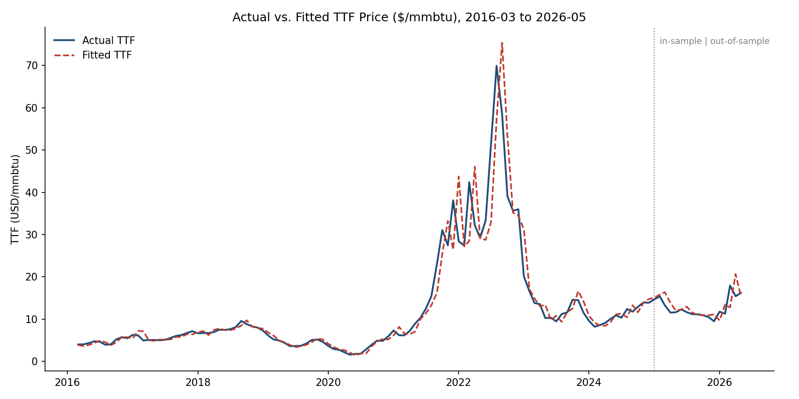
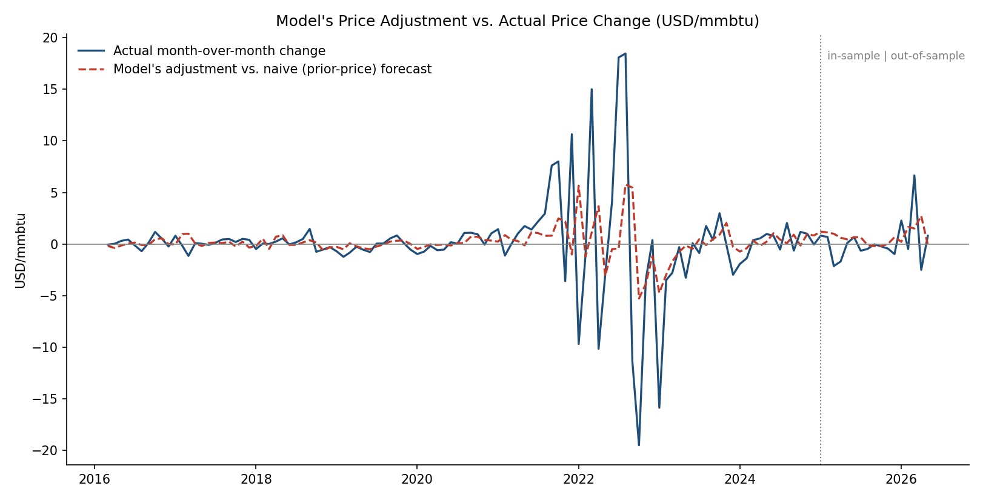

# European Natural Gas Data and Modelling for Forecasting TTF Prices

**Author:** *to be filled in*
**Date:** July 2026
**Repo:** [link to code/data folder]

> This is a toy model built to explore whether publicly available European gas market data can add any forecasting value for TTF prices. It is not a production trading or investment tool, and should not be used as one.

---

## 1. Executive Summary

This model uses a simple European natural gas market dataset, built entirely from free and public sources, to test how well such data can econometrically forecast month-ahead TTF prices. The final specification — a lagged, deseasonalized combination of price momentum, the change in European gas storage, LNG sendout, and London heating-degree-days — shows a modest but consistent improvement over naive benchmarks (a random walk and a momentum-only model) in an out-of-sample walk-forward backtest, though the improvement does not clear conventional statistical significance thresholds at every horizon tested.

## 2. Market Context

Understanding the European natural gas market is important context for interpreting TTF and other European gas prices. Some of the most important fundamental drivers of the market are underground storage levels, winter temperatures, and LNG availability. Data on these drivers is available at different frequencies and depths of history: some series are only available monthly but stretch back further, while others are available daily but have a shorter history. This study uses the monthly series throughout, prioritizing a longer, consistent history over higher-frequency granularity.

## 3. Dataset

| Variable | Source | Frequency | Period |
|---|---|---|---|
| TTF Price | Yahoo Finance | Monthly | 2015-01 to Present |
| EU+UK Gas storage | AGSI/GIE | Monthly | 2015-01 to Present |
| EU+UK LNG sendout | ALSI | Monthly | 2015-01 to Present |
| EU+UK HDDs | ECMWF | Monthly | 2015-01 to Present |
| EU+UK Gas pipeline transmission | ENTSOG | Monthly | 2015-01 to Present |
| Norwegian gas pipeline flows | ENTSOG | Monthly | 2015-01 to Present |
| EU+UK Power load | ENTSOE | Monthly | 2015-01 to Present |
| EU+UK Wind power generation | ENTSOE | Monthly | 2015-01 to Present |
| EU+UK Gas production | Eurostat | Monthly | 2015-01 to Present |
| EU+UK Gas consumption | Eurostat | Monthly | 2015-01 to Present |

## 4. Processing

- Determined how far back a coherent, gap-free time series could be constructed across all sources.
- Handled missing data via interpolation, external research, or separate modelling where necessary.
- Excluded non-European benchmark prices (JKM, Henry Hub) to isolate purely European fundamentals.
- Constructed a **storage change** variable as the month-over-month change in EU+UK average gas storage (bcm) — a flow measure of whether the market tightened or loosened that month.
- Transformed variables as appropriate (e.g. log-differenced) and tested for stationarity with ADF/KPSS.
- Deseasonalized key predictors into **anomalies** using an expanding, out-of-sample-safe calendar-month climatology — each observation is compared only to prior years' same-month average, never to future data.
- Where individual supply/demand sub-components were collinear by construction (an accounting identity), a single composite or flow variable was used instead of the raw components together.
- Lagged all predictors relative to the return period they forecast, so every regressor is predetermined and not contaminated by same-period simultaneity.
- Split the data so the training set runs up to the end of 2024 and the test set covers the remainder of the dataset, through May 2026.

## 5. Methodology

- Variable selection was tied to market-fundamentals reasoning, including checking whether apparent effects reflect genuine surprise information or already-anticipated seasonal patterns.
- Estimated a time series multiple regression on a relatively small sample (approx. 120 observations), with Newey-West HAC standard errors to account for residual autocorrelation and heteroskedasticity (checked via Durbin-Watson, residual autocorrelation, and Breusch-Pagan tests).
- Backtested with an expanding-window walk-forward procedure: starting from a minimum fit size, the model is refit at each step using only data available up to that point and used to forecast one month ahead, through to May 2026.
- Benchmarked against a random walk (no-change) and a momentum-only (AR(1)) model.
- Checked robustness across 1- to 3-month forecast horizons, with results treated as suggestive rather than confirmatory given the small sample and the known bias of overlapping-window regressions toward inflated apparent fit at longer horizons.

## 6. Results

### Model specification

We estimate the one-month-ahead change in log TTF price as a function of four lagged, seasonally-adjusted fundamentals:

$$
\Delta\log(TTF)_t = \beta_0 + \beta_1 \, \text{Momentum}_{t-1} + \beta_2 \, \text{StorageChange}_{t-1} + \beta_3 \, \text{LNG}_{t-1} + \beta_4 \, \text{HDD}_{t-1} + \varepsilon_t
$$

All four regressors are anomalies relative to an expanding, out-of-sample-safe calendar-month climatology, lagged one month so that every predictor is predetermined relative to the return it forecasts:

- **Momentum** — the deseasonalized lagged monthly TTF return itself
- **StorageChange** — the deseasonalized month-over-month change in EU+UK gas storage (bcm)
- **LNG** — the deseasonalized log LNG sendout
- **HDD** — the deseasonalized London heating-degree-days

The model is estimated by OLS over 2016-03 to 2024-12 (n = 106), with Newey–West HAC standard errors (Bartlett kernel) to account for both serial correlation and heteroskedasticity in the residuals.

### Coefficient estimates

| Variable | Coefficient | HAC Std. Error | t-stat | p-value | Sig. |
|---|---:|---:|---:|---:|:---:|
| Const | 0.0573 | 0.0224 | 2.56 | 0.012 | \*\* |
| Momentum (t-1) | 0.1914 | 0.1237 | 1.55 | 0.125 | |
| Storage change anomaly (t-1) | -0.0121 | 0.0058 | -2.10 | 0.038 | \*\* |
| LNG sendout anomaly (t-1) | -0.1241 | 0.0531 | -2.34 | 0.021 | \*\* |
| London HDD anomaly (t-1) | -0.0008 | 0.0004 | -1.96 | 0.052 | \* |

\*\* p<0.05, \* p<0.10

**R² = 0.205, adjusted R² = 0.173** (n=106, 4 regressors + constant).

Storage change and LNG sendout anomalies are significant at the 5% level; London HDD anomaly is marginal (p=0.052); momentum is not significant once the fundamentals are controlled for (p=0.125). All three fundamental variables carry a negative sign: a market that tightened less than usual (storage built up faster than normal, more LNG than normal arrived, or it was warmer than normal) tends to see the TTF price fall slightly the following month — directionally consistent with a supply-demand-driven, gradually-diffusing price effect. See Section 7 for a fuller discussion, including why HDD's sign is negative despite intuitively "colder should mean higher prices."

### Diagnostics

| Test | Statistic | Interpretation |
|---|---|---|
| Durbin–Watson | 1.96 | No material residual autocorrelation (≈2.0 = ideal) |
| Residual lag-1 autocorrelation | 0.02 | Confirms residuals are close to white noise |
| Breusch–Pagan LM test | 8.27 (p = 0.082) | Only marginal evidence of heteroskedasticity (not significant at 5%) |

Residual autocorrelation is essentially absent, and the Breusch-Pagan test does not reject homoskedasticity at conventional significance levels, though it is close enough to the 10% boundary — and heteroskedasticity is common enough in commodity return data generally — that Newey-West HAC standard errors were retained throughout for robustness rather than relying on conventional OLS standard errors.

### Out-of-sample performance

The model was evaluated with an expanding-window walk-forward backtest: starting from a minimum 60-month training window, the model is refit each month using only data available up to that point, and used to forecast the next month's return one step ahead. This produced 63 out-of-sample forecasts spanning 2021-03 to 2026-05, compared against a random-walk (no-change) benchmark, a momentum-only (AR(1)) benchmark, and the historical mean.

| Model | RMSE | MAE | Directional hit rate | OOS R² vs. random walk |
|---|---:|---:|---:|---:|
| Full model (fundamentals + momentum) | 0.192 | 0.142 | 58.7% | +0.087 |
| Momentum-only | 0.203 | 0.150 | 57.1% | -0.027 |
| Random walk (no-change) | 0.201 | 0.151 | n/a* | — |
| Historical mean | 0.201 | 0.153 | 49.2% | -0.007 |

\*Random walk always forecasts zero change, so a directional hit-rate is not defined for it.

The full model outperforms all three benchmarks on RMSE and MAE, and is the only specification with a clearly positive out-of-sample R² relative to the random walk. Its directional hit rate (58.7%) is more modest than its error-based metrics — it is getting the magnitude of moves more right than the direction, which is a useful distinction for interpreting the model rather than a contradiction (see Section 8). A paired test on the loss differential between the full model and the random walk gives a t-statistic of 0.90, which is an improvement over a plain random-walk comparison but still short of conventional significance. Given the short out-of-sample window (63 months, covering essentially one full boom–bust gas-price cycle including the 2021–2023 European energy crisis), this should be read as suggestive rather than statistically conclusive evidence that the European fundamentals used here add real-time forecasting value beyond momentum alone.

### Actual vs. fitted

*Actual TTF price against the model's fitted price level, 2016-03 to 2026-05. Fitted price is reconstructed as the prior month's actual TTF price compounded by the model's predicted one-month log return. Coefficients are estimated once on the 2016-03–2024-12 training sample; the dotted line marks the boundary, after which the 2025-01–2026-05 segment applies the same fixed coefficients to genuinely new, out-of-sample data.*

Because a one-month-ahead return model necessarily produces small adjustments relative to the price level itself, the chart above is dominated visually by the carried-forward previous price (correlation between fitted and naive previous-price ≈ 0.99). The figure below isolates the model's actual contribution — its adjustment relative to a naive "no change" forecast — against what actually happened that month, which is a more direct read on model skill:

*The model's predicted deviation from a naive random-walk forecast (dashed) against the actual month-over-month price change (solid), in USD/mmbtu. The two series share the same direction (sign) in 63.4% of months across the full 2016-03–2026-05 sample.*

### Forecast horizon robustness (1 to 3 months ahead)

The model was re-estimated and re-backtested for 2- and 3-month-ahead horizons (predictors re-lagged accordingly). Predictive performance does not decay with horizon — if anything it improves modestly out to 3 months:

| Horizon | adj. R² (in-sample) | Directional hit rate (OOS) | OOS R² vs. random walk | Loss-differential t-stat |
|---|---:|---:|---:|---:|
| 1 month | 0.173 | 58.7% | 0.087 | 0.90 |
| 2 months | 0.180 | 67.2% | 0.144 | 1.80 |
| 3 months | 0.185 | 57.6% | 0.152 | **2.02** |

At the 3-month horizon, the loss-differential t-statistic (2.02) does clear the conventional ~1.96 significance threshold — the first horizon at which it does so. A concern with overlapping multi-month windows is that longer horizons can mechanically inflate apparent fit even for an unrelated predictor (the Boudoukh–Richardson–Whitelaw overlapping-regression bias). A placebo check using pure random noise in place of the fundamentals showed R² rising with horizon too (roughly 0.3% → 0.9% → 2.8% from H=1 to H=3) — a real effect, but small relative to the model's own in-sample fit at every horizon (17–19% adjusted R²), even though the model's own *rate of increase* with horizon is flatter here than it would be with a stronger predictor, meaning this check is reassuring on absolute levels but not fully conclusive on its own. Taken together, the horizon results should be read as **suggestive corroboration rather than confirmatory evidence** — consistent with, but not independent statistical proof of, the fundamentals having genuine predictive content that persists over a multi-month window.

## 7. Economic Interpretation

**Storage change** is the month-over-month change in EU+UK average gas storage levels (bcm) — a direct flow measure of whether the market tightened or loosened that month, distinct from the storage *level* itself (which was also tested and found to have little standalone explanatory power; see Section 8). A coefficient of -0.0121 is directionally intuitive: when storage built up faster than seasonal-normal (or drew down more slowly) last month, that is a bearish signal, and the TTF price tends to fall slightly the following month.

**LNG sendout** measures how much LNG is being sent into the European gas grid — closely related to LNG imports, though LNG can be stored before being sent into the grid. A coefficient of -0.1241 indicates that a higher-than-normal amount of LNG sent into the grid tends to reduce the TTF price the following month.

**London HDDs** (heating degree days) are a standard measure of how much colder than average the temperature was, used to proxy heating demand. Any European city's HDDs, or a combination, could have been used; London was chosen partly because CME lists London HDD derivatives, which could in principle be combined with this model or with ECMWF/other weather forecasts in future work. The coefficient (-0.0008) is, at first glance, counterintuitive: it says that when it is colder than normal in London, the TTF price tends to *fall* slightly the following month.

This apparent contradiction — HDD, storage change, and LNG all carrying a negative sign — is resolved by looking at *when* each variable's effect shows up, not just its sign. Comparing each variable's contemporaneous correlation with TTF returns to its one-month-lagged correlation reveals two distinct patterns:

- **Storage change and LNG sendout: continuation.** Their contemporaneous and lagged correlations with TTF returns are nearly identical (storage change: -0.31 vs -0.31; LNG: -0.28 vs -0.29). A bearish month for either variable stays bearish into the following month — the effect does not reverse, it persists. This is consistent with **sluggish price discovery**: both are aggregated, reported-with-a-lag physical flow data (AGSI/GIE storage figures, ALSI/ENTSOG LNG and pipeline data) that the market only fully digests over several weeks, not instantly. An unusually loose month keeps weighing on price into the next month as the market gradually absorbs the full scale of what arrived or built up.
- **HDD: reversal.** Here the sign flips (contemporaneous +0.18, lagged -0.08) — the signature of "priced in, then partially unwinds." This is plausible because temperature is a close-to-real-time, continuously observed and actively-traded input (forecasts update daily, weather derivatives exist), so a cold month is absorbed into price almost immediately; what is left over for the following month looks more like a partial correction of that overshoot than genuine residual under-pricing.

The general principle — that physical flow/balance data (LNG, storage, pipeline) diffuses into price gradually, while weather is priced in close to instantly and then partially reverses — is also a reasonable economic prior independent of this dataset, given how each type of data is generated and reported.

**Momentum**, the deseasonalized lagged TTF return, is included primarily as a control: it lets the fundamentals variables be interpreted as adding value *beyond* what is already predictable from the price series' own recent behaviour, and it also absorbs residual autocorrelation that would otherwise be left in the errors.

**The constant** (0.0573) captures the average expected monthly log return conditional on all four anomalies sitting at their seasonally-normal levels — i.e. whatever mean drift is left in TTF prices once the modelled fundamentals are held constant. Over this particular sample, that residual drift is positive, plausibly reflecting the net effect of the 2021–2023 European energy crisis and the structurally higher price level that followed it relative to 2015–2019; with a sample this short and dominated by one major structural break, this should be read as a sample-specific average rather than a stable, forward-looking estimate of "true" trend or risk premium.

## 8. Limitations

- The small number of observations (~100–120 monthly, effectively fewer given autocorrelation) limits the strength of any statistical inference throughout this analysis.
- Variables that are only available with a substantial reporting lag were excluded from the month-ahead model, since by the time they would be available, the forecast would effectively be "forecasting the past." Only variables that can plausibly be estimated or obtained close to real time were used.
- Combinations of more lagged variables were tried for several-months-ahead forecasting, which runs into the Boudoukh–Richardson–Whitelaw overlapping-regression bias discussed in Section 6: this bias reduces the effective number of independent observations, which is already limited in this dataset. The full dataset is nonetheless reported and retained for reference, in case it proves useful for other approaches.
- Storage change outperforms the raw storage *level* anomaly as a predictor in this dataset (see Section 6/7), but a raw supply–demand balance construction (production + LNG sendout + pipeline imports − pipeline exports − consumption) was also tested and found broadly comparable — the choice between these related "market tightness" measures is not fully settled by this sample size, and should be treated as a specification choice rather than a definitively established result.
- The model's out-of-sample directional hit rate (58.7% at H=1) is more modest than its error-based performance (RMSE/OOS R²) would suggest — it appears better at capturing the *size* of a plausible price move than reliably getting its *direction* right every month.
- The model would plausibly improve with the addition of global LNG export capacity utilization, which has been falling as a constraint on price due to the rapid increase in US LNG export capacity — a factor that likely contributed to depressed TTF prices over winter 2025/2026. An international crisis dummy, or a regime-dependent switching model (e.g. conditioned on the VIX or Brent crude), is another plausible extension not attempted here.

## 9. Repository Contents

- `ttf_model.py` — full pipeline: data loading, feature engineering, HAC regression, diagnostics, walk-forward backtest, horizon robustness check, and chart generation.
- `NG_m_final.csv` — underlying dataset (see Section 3 for sources).
- `actual_vs_fitted.png`, `model_adjustment.png` — charts referenced in Section 6.
